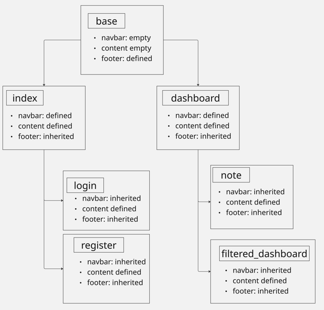

{: .label }
[Jane Dane]

{: .no_toc }
# Architecture

{: .attention }
> This page describes how the application is structured and how important parts of the app work. It should give a new-joiner sufficient technical knowledge for contributing to the codebase.
> 
> See [this blog post](https://matklad.github.io/2021/02/06/ARCHITECTURE.md.html) for an explanation of the concept and these examples:
>
> + <https://github.com/rust-lang/rust-analyzer/blob/master/docs/dev/architecture.md>
> + <https://github.com/Uriopass/Egregoria/blob/master/ARCHITECTURE.md>
> + <https://github.com/davish/obsidian-full-calendar/blob/main/src/README.md>
> 
> For structural and behavioral illustration, you might want to leverage [Mermaid](../ui-components.md), e.g., by charting common [C4](https://c4model.com/) or [UML](https://www.omg.org/spec/UML) diagrams.
> 
>
> You may delete this `attention` box.

{: .text-delta }

Table of contents

+ ToC
{: toc }

## Overview

Main parts of the app consist of collecting input from the users and visualize it in different views. The input is collected via WTForms that are rendered via jinja2 templates. SQLAlchemy is used for handling the inputs. The input is stored in a local database. To get the input from the database SQLAlchmy is used again. jinja2 is also used for organizing the inheritance of the html files. Bootstrap is used for the styling of the pages. There are detailed comments in the code. 

## Codemap

The main part of the app is the app.py file. It includes:
+ Import of all used packages
+ Definition of all functions that are used 
+ Initialization of the database and app
+ Definition of the classes for all entities and the forms that are used to collect the input for the database
+ Routes for processing the requests and calling the right functions

Beside this there is a template folder which includes:
+ base
+ index
+ login
+ register
+ dashboard
+ filtered_dashboard
+ note

The inheritance structure of these html files is visualized in this overview ([it is also accessible through this Miro-Link](https://miro.com/app/board/uXjVIOX94I4=/)): 

There is also a static folder including the style.css file. It includes styling for the following components:
+ holy grail: this component is needed to set the layout for all other containers as header, footer or content (it orders them as columns instead of rows)
+ header and footer: contain the styling of the navigation bar (header) and the footer
+ content: sets the directions of containers that are stored inside an a 'content' container as rows; this is how sidebar and main are layouted vertical 
+ full-width: styles the content that has no sidebar (Login, Register, Note)
+ main: styles all relevant content that is shown on pages with a sidebar
+ sidebar: styles the sidebar
+ card: styles the notes on the dashboard and filtered_dashboard
  
## Cross-cutting concerns

[Describe anything that is important for a solid understanding of your codebase. Most likely, you want to explain the behavior of (parts of) your application. In this section, you may also link to important [design decisions](../design-decisions.md).]
