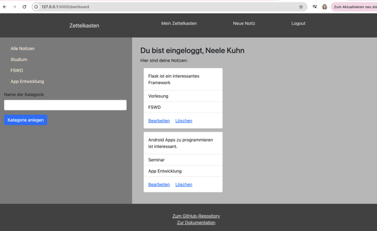

{: .no_toc }
# Reference documentation

{: .text-delta }

Table of contents

+ ToC
{: toc }

## Login

### login()

**Route:** '/login'

**Methods:** `POST` `GET` 

**Purpose:** Login the user and redirect to the dashboard if login is successful.

**Sample output:**

Redirection to dashboard or show Error if Login was not successful.

---

## Dashboard

### dashboard()

**Route:** '/dashboard'

**Methods:** `POST` `GET` 

**Purpose:** Show all Notes from the user and show all categories in a sidebar.

**Sample output:**

---
## Register

### register()

**Route:** '/register'

**Methods:** `POST` `GET` 

**Purpose:** Register the user and redirect to the Login if registration is successful.

**Sample output:**

Redirection to login or show Error if Registration was not successful.

---

## Dashboard

### dashboard()

**Route:** '/dashboard'

**Methods:** `POST` `GET` 

**Purpose:** Show all Notes from the user and show all categories in a sidebar.

**Sample output:**

---

## Note
### note()

**Route:** '/note'

**Methods:** `POST` `GET` 

**Purpose:** Show form to create a new note and save the new note. 

**Sample output:**

---

## Change note
### change_note(id)

**Route:** '/change_note/<int:id>'

**Methods:** `POST` `GET` 

**Purpose:** Show form to change a note with prefilled fields. 

**Sample output:**

---

## Filter dashboard
### filtered_dashboard(id)

**Route:** '/filtered_dashboard/<int:id>'

**Methods:** `POST` `GET` 

**Purpose:** Show all Notes from the chosen category and show all categories in a sidebar.

**Sample output:**

---

## Delete Note
### delete_note(id)

**Route:** '/delete_note/<int:id>'

**Methods:** `POST` `GET` 

**Purpose:** Deleting the chosen note.
**Sample output:**

Dashboard without the deleted note.