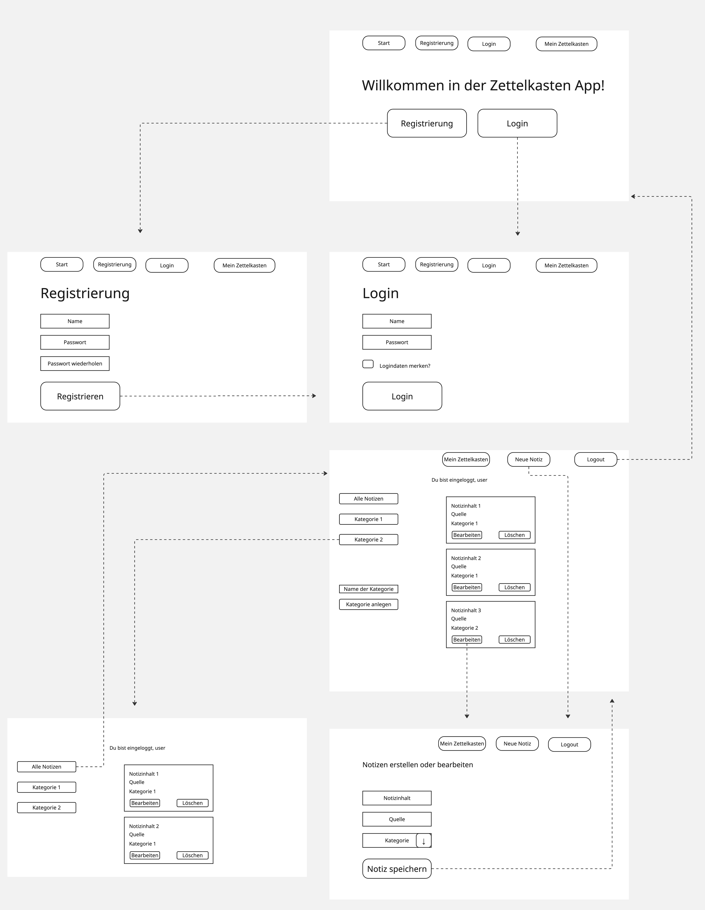

{: .label }
[Jane Dane]

{: .no_toc }
# Value proposition

{: .text-delta }

Table of contents

+ ToC
{: toc }

## The problem

When working in scientific context there are many information in different sources. In addition there are also personal thoughts and ideas about the content a person is reading. For writing scientific papers it is important to have a system for sorting and clustering the notes. 

## The solution

This application provides the technical base for taking notes and notes of the same category. 
There are 5 main functions:
 + Creating a user account
 + Taking notes including content, source and category
 + Creating new categories
 + Filtering the notes according to categories
 + Deleting notes that are unnecessary
 

## Target user

The primary target group are graduating students writing their final thesis. 
In general the method and application can be used in every context where notes and information has to be clustered and managed. Currently there is just the option to work on one project at the time. Because of this it is not perfectly fitted for people who work on more than one project at the time. 

## Customer journey

The customer journey starts with the greeting and the option to login or register. Once logged in, the user can navigate through the notes of the different categories or take new notes. The navigation bar on top makes it possible to switch from every screen to every other screen. In the picture below you can find the user flow ([it is also accessible through this Miro-Link](https://miro.com/app/board/uXjVIOX94I4=/)):  